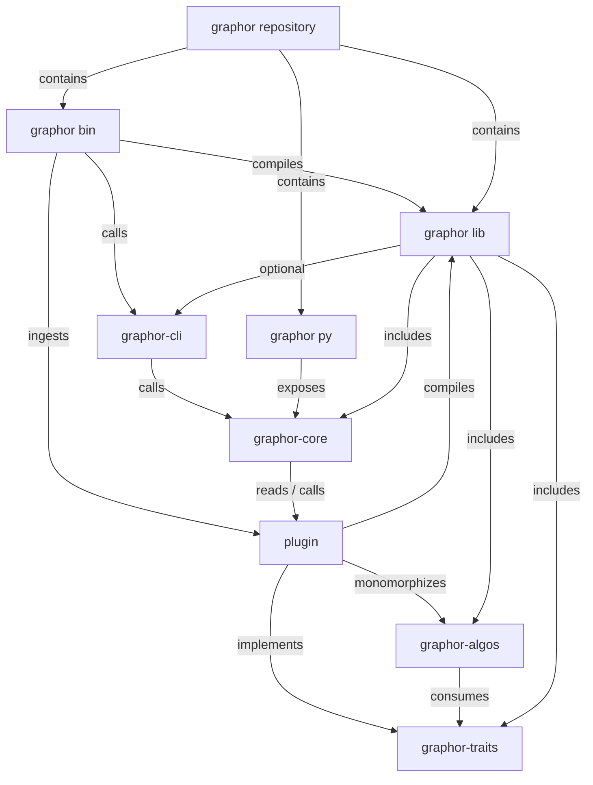

Here we focus on the organization of the Graphor platform across different libraries, binaries, and modules. This is intended as an introduction to the project, not as a reference.

## Module Diagram

## Remarks

Here we will attempt to justify and explain some design decisions in a Q&A format.

### What is ____?

Here is each component's description.

* **graphor repository.** The GitHub repository containing everything here.
* **graphor lib.** `graphor` itself. Contains all Rust code, some behind [feature gates](https://rustc-dev-guide.rust-lang.org/feature-gates.html).
* **graphor-core.** Core plugin execution API in `gaphor`.
* **graphor-cli.** CLI implementation in `graphor`; minimal frontend for core API.
* **graphor py.** Python PyPi package containing bindings to the `graphor-core` API.
* **graphor bin.** Rust binary crate that allows registering and executing plugins.
* **graphor-algos.** Algorithm implementations in `graphor`.
* **graphor-traits.** Trait declarations in `graphor`.
* **plugin.** An example plugin implementing `graphor` traits.

### Why dynamic libraries?

In principle, the amount of existing plugins is unbounded, as well as the amount of people working on one at any given point. At least, it is somewhat independent of the amount of people working on `graphor`. Dynamic libraries as a design decision permits independent authorship without the need for a central body of developers, who would otherwise be a development bottleneck.

### Where does data live?

When a plugin is implemented, all of the generic code used in `graphor` is specialized at the time of compilation. This includes the algorithms that perform graph traversals and the database code that stores the desired features associated with graph vertices.

So, when a plugin is 'executed,' the core routines of `graphor` figure out the minimum amount of algorithms that need to be executed to figure out the features requested by a user. Then they are executed, and the data they compute is stored by plugin code into a persistent database file which is later recovered and coalesced by `graphor`.
